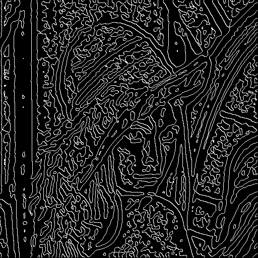
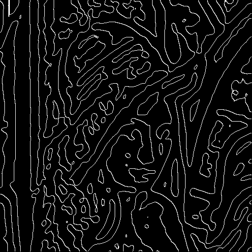
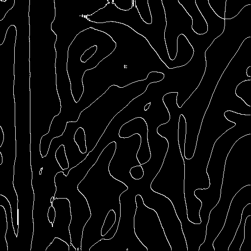
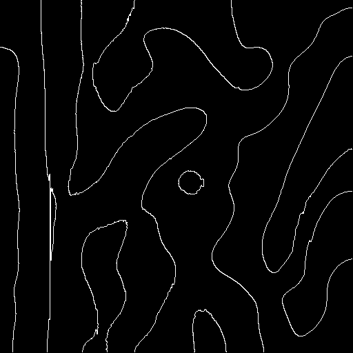
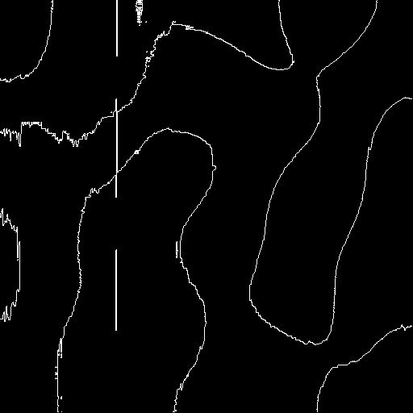

## Edge detection

CV project to implement edge detection algorithm.

Run as python3 prog1.py -i (imagename)\
or\
python3 -m prog1.py -i (imagename)

The program outputs five .png files corresponding to variable values for sigma which determines the 
size of the kernel to be used.

#### Needed libraries:
opencv

#### Input:

#### Output:

